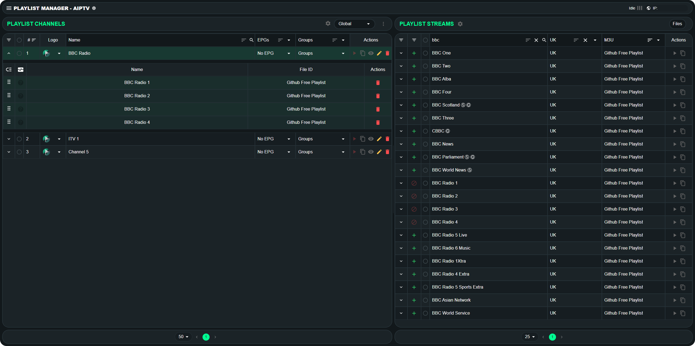

# User Interface / Pages / Playlist Manager

## 📖 Table of Contents

1. [User Interface / Pages / Playlist Manager](#user-interface--pages--playlist-manager)
    - [Page Overview](#page-overview)
    - [Top Navigation](#top-navigation)
    - [Playlist Channels (also known as the ◀️ LEFT side)](#playlist-channels-also-known-as-the--left-side)
        - [Header](#header)
        - [Table](#table)
    - [Playlist Streams (also known as the ▶️ RIGHT side)](#playlist-streams-also-known-as-the-right-side)
        - [Header](#header-1)
        - [Table](#table-1)
    - [Need Help? Join the Community!](#need-help-join-the-community)

 

## Page Overview

The **Playlist** page is the main section of the aIPTV user interface, divided into two sections:
- **[Left Side (Playlist Channels):](../../Assets/Pages/Playlist/left_side.png)** Displays the final playlist available to users.
- **[Right Side (Playlist Streams):](../../Assets/Pages/Playlist/right_side.png)** Shows the stream sources from your playlists.

### Top Navigation
At the **[top of the page](../../Assets/Pages/Playlist/top_navigation.png)**, you will find:
- **Left Side:**
  - **Hamburger Menu (☰):** Opens the navigation menu to access other pages.
  - **aIPTV Name & Version:** Hovering over the small "i" icon displays the version number.
- **Right Side:**
  - **Streaming Indicator:** An animation appears when an active stream is running. Clicking redirects to the **Stats** page.
  - **Public IP Address:** Displays your instance's public IP. Clicking copies it to the clipboard.

 

## Playlist Channels (also known as the ◀️ LEFT side) - **[Preview](../../Assets/Pages/Playlist/left_side.png)**

### **[Header](../../Assets/Pages/Playlist/left_header.png)**
The header consists of a **title** and an **action bar**:
- **Left Side:** "Playlist Channels" title.
- **Right Side (Action Bar):**
  1. **Streaming Settings (⚙️): [(Preview)](../../Assets/Pages/Playlist/popup_streamin_settings.png)** Opens a settings popup to configure:
     - Proxy or FFMPEG method
     - User agent
     - Max retry attempts & delay
     - Stream refresh interval
     - Additional FFMPEG profiles (if using FFMPEG)
  2. **Stream Profiles Dropdown:** Default is "Global" profile.
     - **Action Bar:** Includes a **Filter**, **Add** (➕), and **Edit** (✏️) button.
     - **Profile List:** Displays:
       - Profile Name & Channel Count
       - **M3U, EPG, HDHR URL copy buttons**
       - More options (**⋮** menu):
         - M3U/EPG Download
         - Copy Channel Visibility
         - Profile Settings (Max Streams, Timeout, Export Options)
  3. **More Options (⋮) Menu:**
     - **Link EPG Channels: [(Preview)](../../Assets/Pages/Playlist/popup_link_epg_channels.png)** Opens an EPG linking popup.
     - **Select Channels to Renumber: [(Preview)](../../Assets/Pages/Playlist/popup_renumber_channels.png)** Opens sorting/ordering options.
     - **Add Channel (➕):** Adds an empty channel to modify.

### **[Table](../../Assets/Pages/Playlist/left_table.png)**
The **Playlist Channels** table (left side) contains:
1. **Expand Arrow (⯆):** Reveals backup streams ordered top-to-bottom.
   - Reorder (drag & drop)
   - Health Monitor (Green/Red/Neutral)
   - Original Stream Name & File ID
   - Delete Source (🗑️)
2. **Radio Button:** Allows multiple selections.
3. **Channel Number**
4. **Channel Logo** (default or custom)
5. **Channel Name** (modifiable, independent of stream names)
6. **EPG Selection** for channel
7. **Channel Groups** (assigned category for playlist export)
8. **Actions Bar:**
   - **Play (▶️):** Opens Web Player
   - **Copy (📋):** Copies Channel URL
   - **Eye (👁️):** Hides channel in current profile
   - **Edit (✏️):** Opens "Edit Channel" modal
   - **Delete (🗑️):** Removes channel
9. **Pagination Menu** at the bottom.

 

## Playlist Streams (also known as the ▶️ RIGHT side) - **[Preview](../../Assets/Pages/Playlist/right_side.png)**

### **[Header](../../Assets/Pages/Playlist/right_header.png)**
The header includes a **title**, **stream settings**, and a **file manager**:
1. **Stream Settings (⚙️): [(Preview)](../../Assets/Pages/Playlist/popup_stream_settings.png)**
   - **Group Identical Streams** (merge same-named streams)
   - **Use Stream Channel Numbers** (uses original stream numbers)
   - **Auto-Assign Dummy EPG** (default EPG for new channels)
2. **Files Button: [(Preview)](../../Assets/Pages/Playlist/popup_file_manager.png)** Opens File Manager to import Playlists & EPG sources.
   - **Update Groups:** Manage and declutter playlist groups.
   - **Manage Profiles:** Use REGEX to handle multiple provider playlists.
   - **File Manager Settings Cog (⚙️): [(Preview)](../../Assets/Pages/Playlist/popup_file_manager_settings.png)**
        - Auto Import Settings
        - Stream Grouping Settings
        - PPV Settings

### **[Table](../../Assets/Pages/Playlist/right_table.png)**
The **Playlist Streams** table (right side) contains:
1. **Expand Arrow (⯆):** Reveals grouped streams by name/profile.
   - Reorder (drag & drop)
   - Health Monitor (Green/Red/Neutral)
   - Stream URL & Profile
   - **Play (▶️)** (direct stream without proxy) & **Copy (📋)** (original URL)
2. **Create/Add Stream:**
   - **(+) Create Channel:** Adds a new channel with selected stream.
   - **Add to Existing:** Select a channel (left side) → Expand → Click **Add**.
3. **Radio Button:** Multi-selection for bulk actions.
4. **Stream Name** (from playlist)
5. **Stream Group** (imported category)
6. **M3U (File ID)** (source playlist reference)
7. **Actions Bar:**
   - **Multi-source Indicator** (if applicable)
   - **Play (▶️):** Opens Web Player
   - **Copy (📋):** Copies original URL
8. **Pagination Menu** at the bottom.

 

## 🔗 Need Help? Join the Community!
If you run into any issues or have questions, join our **[Discord Channel](https://discord.gg/tP3JcygCA8)** for support and discussion!

